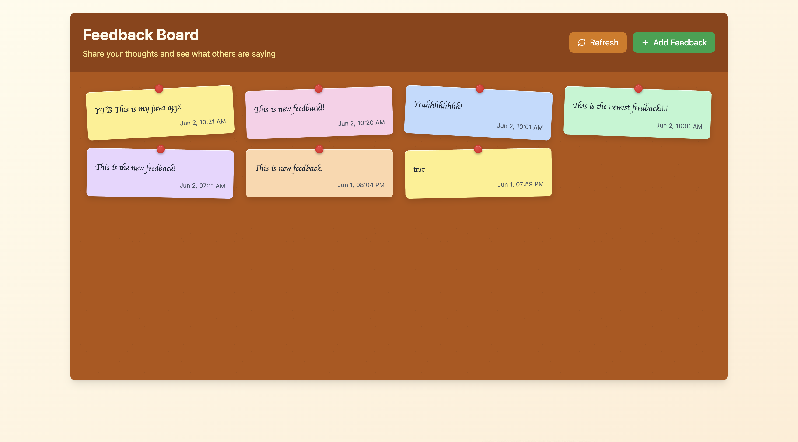

# FeedbackFuse

A modern feedback collection application built with Django REST Framework and React. FeedbackFuse allows users to submit anonymous feedback messages and view all submitted feedback in a clean, responsive interface.

## Preview



## 🚀 Features

- **Anonymous Feedback Submission**: Users can submit feedback without registration
- **Real-time Feedback Display**: View all feedback messages ordered by newest first
- **Responsive Design**: Built with Tailwind CSS for optimal mobile and desktop experience
- **RESTful API**: Clean API endpoints for seamless frontend-backend communication
- **Modern Tech Stack**: Django REST Framework backend with React frontend

## 🏗️ Project Structure

```
FeedbackFuse/
├── FeedbackFuseBackend/          # Django REST Framework backend
│   ├── manage.py
│   ├── requirements.txt
│   └── [Django project files]
└── FeedbackFuseFrontend/         # React frontend
    ├── package.json
    ├── tailwind.config.js
    └── [React project files]
```

## 🛠️ Technology Stack

### Backend
- **Django**: Web framework
- **Django REST Framework**: API development
- **Python**: Programming language

### Frontend
- **React**: Frontend library
- **Tailwind CSS**: Utility-first CSS framework
- **JavaScript/JSX**: Programming languages

## 📋 Prerequisites

Before running this application, make sure you have the following installed:

- Python 3.8+
- Node.js 16+
- npm or yarn

## ⚡ Quick Start

### Backend Setup

1. Navigate to the backend directory:
   ```bash
   cd FeedbackFuseBackend
   ```

2. Create and activate a virtual environment:
   ```bash
   python -m venv venv
   source venv/bin/activate  # On Windows: venv\Scripts\activate
   ```

3. Install dependencies:
   ```bash
   pip install -r requirements.txt
   ```

4. Run migrations:
   ```bash
   python manage.py migrate
   ```

5. Start the development server:
   ```bash
   python manage.py runserver
   ```

The backend API will be available at `http://localhost:8000`

### Frontend Setup

1. Navigate to the frontend directory:
   ```bash
   cd FeedbackFuseFrontend
   ```

2. Install dependencies:
   ```bash
   npm install
   ```

3. Start the development server:
   ```bash
   npm start
   ```

The frontend application will be available at `http://localhost:3000`

## 🔧 Development

### Backend Development
- The Django backend uses Django REST Framework for API endpoints
- Models are defined for feedback storage
- CORS is configured to allow frontend communication

### Frontend Development
- React components handle user interface
- Tailwind CSS provides responsive styling
- Axios or fetch API for backend communication

## 🚀 Deployment

### Backend Deployment
1. Set up environment variables for production
2. Configure database settings
3. Collect static files: `python manage.py collectstatic`
4. Deploy to your preferred hosting service (Heroku, AWS, etc.)

### Frontend Deployment
1. Build the production version: `npm run build`
2. Deploy the build folder to your hosting service (Netlify, Vercel, etc.)
3. Update API endpoints to point to production backend

## 🤝 Contributing

1. Fork the repository
2. Create a feature branch: `git checkout -b feature-name`
3. Commit your changes: `git commit -m 'Add some feature'`
4. Push to the branch: `git push origin feature-name`
5. Submit a pull request

## 📝 License

This project is licensed under the MIT License - see the LICENSE file for details.

## 📞 Support

If you have any questions or issues, please open an issue on the GitHub repository.

---

Built with ❤️ using Django REST Framework and React